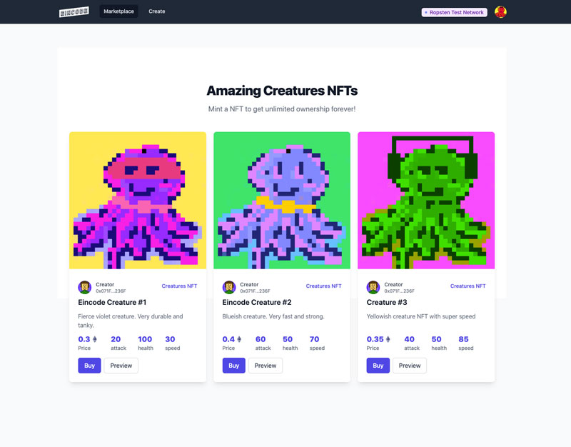

# NFT marketplace

In this project,  I created an interactive NFT marketplace in React, Typescript & Solidity. Clients on this platform will be able to purchase NFTs with Ether digital currency.
The application is created in the Next JS framework, built on top of the React JS.
## Overview

Marketplace has dependencies on multiple technologies.

* [Pinata](https://app.pinata.cloud/) - store images, and NFT metadata
* [Ganache](https://trufflesuite.com/ganache/) - private Blockchain, to run application localy

[Live](https://nftmarket-jade.vercel.app/)



## To run the app
1. run `npm install` to install dependencies

2. In the root folder of the application create a `.env.development` file with following content:

```
NEXT_PUBLIC_NETWORK_ID=5777
NEXT_PUBLIC_TARGET_CHAIN_ID=1337
NEXT_PUBLIC_PINATA_DOMAIN=https://gateway.pinata.cloud

SECRET_COOKIE_PASSWORD={your custom at least 32 characters long password!}

PINATA_API_KEY={your api key from pinata}
PINATA_SECRET_API_KEY={your api secret key from pinata}

INFURA_ROPSTEN_URL=https://ropsten.infura.io/v3/xxxxx
```
* (your api pinata key has to allow `pinFileToIPFS` and `pinJSONToIPFS` rules)

3. Then migrate a contract to Ganache, contract can be found in the `contracts` folder. It's called `NftMarket.sol`

* To migrate the contract run `truffle migrate` in the terminal while Ganache network is setup and running.

* Do not forget to link `trufle-config.js` with Ganache, just go to `config` and click `Add Project`

* `keys.json` must be created if you want to deploy to Ropsten, if not, just remove import of `keys.json` from `trufle-config.js` and also comment out `ropsten` configuration

4. Now everything is setup and you can test out the app.

* Run `npm run dev` in the terminal. App will run at `localhost:3000`

### Deployment
1. Infura.io
2. Create new project
3. Select endpoint -> Ropsten in my case or Rinkeby, you can get free Ropsten ETH => https://moonborrow.com/
4. Copy the API key endpoint url with https://. and add it to your .env file
5. Create `keys.json` in the root directory, add to `gitignore`. Add your metamask private key in this format
```
{
  "PRIVATE_KEY": "xxxxxxxx",
  "INFURA_ROPSTEN_URL": "https://ropsten.infura.io/v3/xxxxxxx"
}
```
6. Deploy contract to ropsten: `truffle migrate --network ropsten`

> contract address: 0xbC38c937dAd7f548251EB5Ee2b9a3b6CfEd964BF